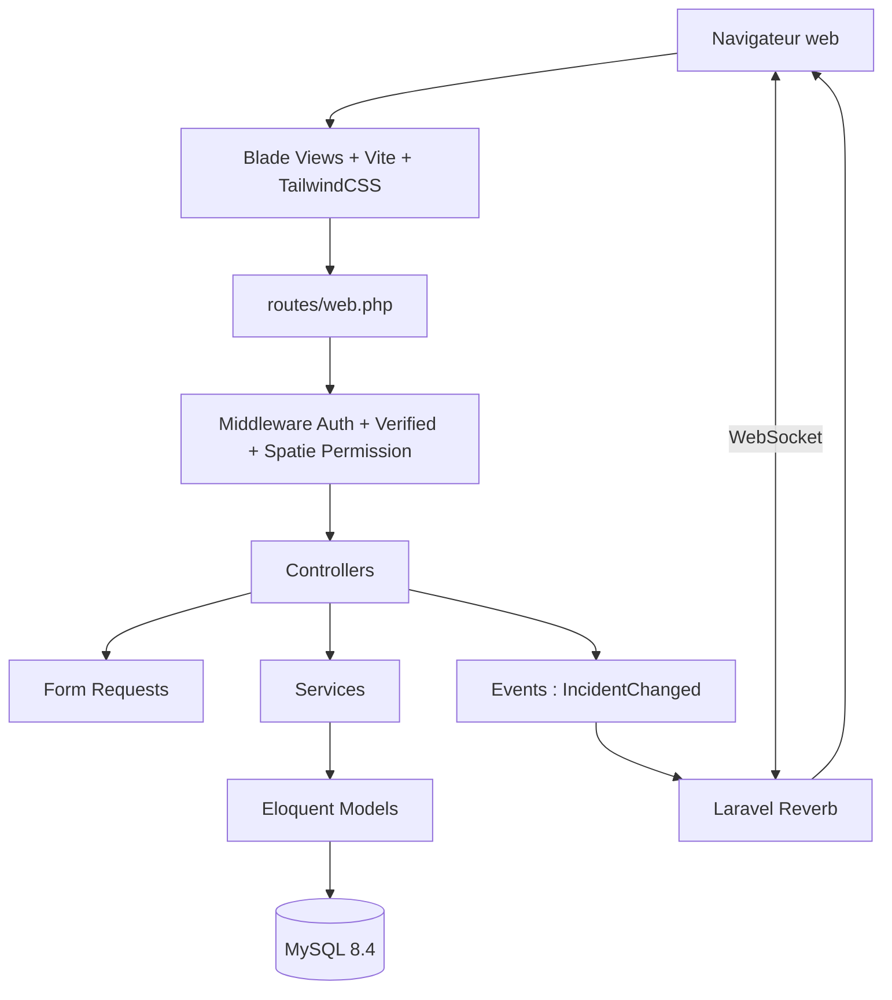
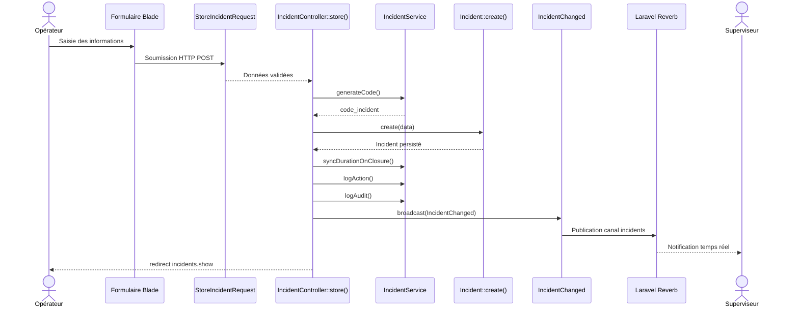

# Architecture de l'application

## 1. Vue d'ensemble
L'application repose sur une architecture **Laravel MVC enrichie** par :

- des **Form Requests** pour la validation ;
- une couche **Services** pour la logique métier réutilisable ;
- un mécanisme **Events + Laravel Reverb** pour le temps réel ;
- des **Exports** pour les rapports PDF/Excel ;
- des **vues Blade** servies via **Vite** et stylées avec **TailwindCSS/Bootstrap utilitaire existant**.

### 1.1 Schéma global


### 1.2 Lecture du schéma
- Le **navigateur** charge les vues Blade compilées et les assets Vite.
- Les requêtes HTTP arrivent dans `routes/web.php`.
- Les middlewares contrôlent l'authentification, la vérification d'e-mail et les permissions métier.
- Les contrôleurs orchestrent la requête, appellent si besoin les Form Requests et les Services.
- Les Services centralisent la logique transversale comme la génération de code incident ou la préparation des rapports.
- Les modèles Eloquent assurent la persistance vers MySQL.
- Les événements broadcastés via **Reverb** notifient instantanément les clients connectés.

## 2. Structure des répertoires

### 2.1 Arborescence commentée
```text
app/
├── Events/
│   └── IncidentChanged.php              # Événement broadcasté en temps réel
├── Exports/
│   ├── IncidentReportExport.php         # Export Excel des rapports périodiques
│   └── IncidentsExport.php              # Export natif XLSX de la liste d'incidents
├── Http/
│   ├── Controllers/
│   │   ├── Controller.php               # Contrôleur de base Laravel
│   │   ├── DashboardController.php      # KPIs, graphiques et agrégats du dashboard
│   │   ├── IncidentController.php       # CRUD incidents, export, incidents en cours
│   │   ├── ReportController.php         # Rapports journaliers/mensuels PDF/Excel
│   │   ├── HistoriqueController.php     # Consultation/export des historiques et logs
│   │   ├── UserController.php           # Gestion des utilisateurs
│   │   ├── ProfileController.php        # Gestion du profil connecté
│   │   ├── DepartementController.php    # CRUD catalogue des départs
│   │   ├── TypeIncidentController.php   # CRUD catalogue types d'incidents
│   │   ├── CauseController.php          # CRUD catalogue causes + endpoint AJAX byType
│   │   ├── StatutController.php         # CRUD catalogue statuts
│   │   └── PrioriteController.php       # CRUD catalogue priorités
│   └── Requests/
│       ├── StoreIncidentRequest.php     # Validation création incident
│       ├── UpdateIncidentRequest.php    # Validation mise à jour incident
│       ├── DailyReportRequest.php       # Validation rapport journalier
│       ├── MonthlyReportRequest.php     # Validation rapport mensuel
│       └── ProfileUpdateRequest.php     # Validation profil utilisateur
├── Models/
│   ├── User.php                         # Utilisateur applicatif
│   ├── Departement.php                  # Départ/entité réseau
│   ├── TypeIncident.php                 # Type d'incident
│   ├── Cause.php                        # Cause d'incident
│   ├── Statut.php                       # Statut métier
│   ├── Priorite.php                     # Priorité métier
│   ├── Incident.php                     # Entité centrale
│   ├── IncidentAction.php               # Historique détaillé des actions
│   └── Log.php                          # Audit transversal
└── Services/
    ├── IncidentService.php              # Code incident, durée, logs, audit
    └── IncidentReportService.php        # Agrégats et jeux de données pour les rapports

database/
├── migrations/                          # 15 migrations de structure
│   ├── 0001_...create_users_table.php
│   ├── 0001_...create_cache_table.php
│   ├── 0001_...create_jobs_table.php
│   ├── 2026_03_30_085420_create_departements_table.php
│   ├── 2026_03_30_085451_create_type_incidents_table.php
│   ├── 2026_03_30_085527_create_causes_table.php
│   ├── 2026_03_30_085603_create_statuses_table.php
│   ├── 2026_03_30_085636_create_priorites_table.php
│   ├── 2026_03_30_085711_create_incidents_table.php
│   ├── 2026_03_30_085745_create_incident_actions_table.php
│   ├── 2026_03_30_085818_create_logs_table.php
│   ├── 2026_03_30_114244_create_permission_tables.php
│   ├── 2026_03_30_202116_add_ceet_fields_to_departements_table.php
│   ├── 2026_04_01_120500_add_profile_fields_to_users_table.php
│   └── 2026_04_02_120000_add_updated_at_to_logs_table.php
└── seeders/                             # 11 fichiers dont 10 seeders métier + DatabaseSeeder
    ├── DatabaseSeeder.php
    ├── RolesAndPermissionsSeeder.php
    ├── AdminUserSeeder.php
    ├── OperatorUserSeeder.php
    ├── DepartementSeeder.php
    ├── TypeIncidentSeeder.php
    ├── CauseSeeder.php
    ├── StatutSeeder.php
    ├── PrioriteSeeder.php
    ├── IncidentSeeder.php
    └── LogSeeder.php

resources/
├── js/
│   ├── app.js                           # Bootstrap JS, Alpine, Tom Select
│   ├── incident-form.js                 # UX formulaire incident
│   └── charts/
│       ├── dashboard.js                 # Initialisation des graphiques dashboard
│       └── reports.js                   # Initialisation des graphiques rapports
└── views/
    ├── dashboard.blade.php              # Tableau de bord principal
    ├── incidents/                       # CRUD, formulaire, vue en-cours
    ├── catalogues/                      # Départs, types, causes, statuts, priorités
    ├── reports/                         # Analyse mensuelle et exports
    ├── historique/                      # Audit et export PDF
    ├── users/                           # Administration utilisateurs
    ├── profile/                         # Profil utilisateur
    └── layouts/                         # Layout principal, navigation, guest

routes/
├── web.php                              # Routes métier authentifiées
└── auth.php                             # Routes d'authentification Breeze/Laravel
```

### 2.2 Commentaire architectural
L'arborescence montre un projet Laravel classique enrichi d'une couche de services.  
Le dossier `resources/views` reste central car l'application est rendue côté serveur avec Blade.  
Le dossier `resources/js` joue un rôle complémentaire pour l'amélioration UX et les graphiques, sans transformer l'application en SPA.

## 3. Flux d'un incident

### 3.1 Séquence de création d'un incident


### 3.2 Étapes fonctionnelles
1. L'opérateur remplit le formulaire de déclaration.
2. `StoreIncidentRequest` vérifie les contraintes de validation.
3. `IncidentController::store()` injecte le code incident généré.
4. `IncidentService::syncDurationOnClosure()` calcule la durée si l'incident est finalisé à la création.
5. `IncidentService::logAction()` alimente `incident_actions`.
6. `IncidentService::logAudit()` alimente `logs`.
7. L'événement `IncidentChanged` est broadcasté via Reverb.
8. Les clients connectés reçoivent l'information en temps réel.

## 4. Système d'authentification et rôles

### 4.1 Matrice fonctionnelle cible
| Permission | Administrateur | Superviseur | Opérateur Terrain |
|--------------------|:--------------:|:-----------:|:-----------------:|
| `incidents.view` | ✓ | ✓ | ✓ |
| `incidents.create` | ✓ | ✓ | ✓ |
| `incidents.update` | ✓ | ✓ | ✓ |
| `incidents.delete` | ✓ | ✗ | ✗ |
| Catalogues CRUD | ✓ | ✗ | ✗ |
| Historique/Logs | ✓ | ✓ | ✗ |
| Gestion Users | ✓ | ✗ | ✗ |
| Rapports/Exports | ✓ | ✓ | ✓ |

### 4.2 Implémentation observée dans le dépôt
Le seeder `RolesAndPermissionsSeeder` met actuellement en place :

- `Administrateur` : accès complet incidents, catalogues et utilisateurs ;
- `Superviseur` : `incidents.view`, `incidents.create`, `incidents.update`, `catalogues.view`, `users.view`, `users.manage` ;
- `Opérateur` : `incidents.view`, `incidents.create`, `catalogues.view`.

### 4.3 Remarque importante
La matrice cible du cahier des charges et l'implémentation observée ne sont pas strictement identiques.  
Deux écarts notables existent :

- le rôle **Opérateur** ne possède pas actuellement `incidents.update` dans le seeder ;
- le rôle **Superviseur** reçoit actuellement `users.manage`, ce qui dépasse la matrice cible.

Pour un déploiement en production, une harmonisation entre le CDC et la configuration réelle est recommandée.

## 5. Stack technique détaillée

| Composant | Technologie | Version | Rôle dans le projet |
| --- | --- | --- | --- |
| Langage back-end | PHP | 8.2+ | Exécution du code applicatif |
| Framework | Laravel | 12 | Structure MVC, routing, ORM, auth |
| Base de données | MySQL | 8.4 | Stockage relationnel des données métier |
| ORM | Eloquent | inclus Laravel 12 | Mapping objet-relationnel |
| Front build | Vite | 6.x | Compilation et bundling des assets |
| Styles | TailwindCSS | 3.x | Utilitaires CSS |
| UI complémentaire | Bootstrap | 5.2.x | Composants utilitaires déjà présents |
| Permissions | Spatie laravel-permission | 7.2 | Rôles et permissions |
| Temps réel | Laravel Reverb | 1.10 | Broadcast WebSocket natif |
| Export PDF | DomPDF | 3.1 | Génération de rapports PDF |
| Export Excel | Maatwebsite Excel | 3.1 | Export natif `.xlsx` |
| Graphiques | Chart.js | 4.x | Visualisation dashboard et rapports |
| Conteneurisation | Docker Sail | version Laravel Sail du projet | Environnement de dev conteneurisé |
| Outil JS UX | Tom Select | 2.5.x | Recherche et autocomplétion sur les listes |

## 6. Déploiement Docker

### 6.1 Composition du `compose.yaml`
Le fichier `compose.yaml` définit deux services principaux :

- `laravel.test`
- `mysql`

### 6.2 Service `laravel.test`
Caractéristiques :

- construit depuis `./vendor/laravel/sail/runtimes/8.5` ;
- image résultante : `sail-8.5/app` ;
- expose :
  - le port HTTP `80` mappé sur `${APP_PORT:-80}` ;
  - le port Vite `${VITE_PORT:-5173}` ;
- monte le volume du projet local vers `/var/www/html` ;
- dépend du service `mysql`.

Ce point mérite une remarque : l'application cible **PHP 8.2+**, mais le runtime Sail configuré ici est **PHP 8.5**, ce qui reste compatible vers le haut.

### 6.3 Service `mysql`
Caractéristiques :

- image `mysql:8.4` ;
- port exposé `${FORWARD_DB_PORT:-3306}` ;
- variables injectées :
  - `MYSQL_DATABASE`
  - `MYSQL_USER`
  - `MYSQL_PASSWORD`
  - `MYSQL_ROOT_PASSWORD`
- volume persistant `sail-mysql:/var/lib/mysql` ;
- script d'initialisation du jeu de test monté dans `docker-entrypoint-initdb.d`.

### 6.4 Réseau et volumes
- **Réseau** : `sail`, de type `bridge`
- **Volume persistant** : `sail-mysql`

Le réseau isole les conteneurs tout en permettant à l'application Laravel de joindre MySQL via le nom de service `mysql`.

### 6.5 Variables d'environnement clés pour Docker
| Variable | Usage |
| --- | --- |
| `APP_PORT` | Port HTTP exposé côté hôte |
| `VITE_PORT` | Port Vite en développement |
| `DB_DATABASE` | Nom de la base MySQL |
| `DB_USERNAME` | Utilisateur MySQL |
| `DB_PASSWORD` | Mot de passe MySQL et root dans ce compose |
| `WWWUSER` / `WWWGROUP` | UID/GID pour la cohérence des permissions |
| `SAIL_XDEBUG_MODE` | Activation éventuelle de Xdebug |
| `SAIL_XDEBUG_CONFIG` | Paramètres de connexion Xdebug |

## 7. Conclusion
L'architecture de l'application CEET présente les caractéristiques suivantes :

- un **socle Laravel 12 MVC** classique et robuste ;
- une **couche service légère** pour isoler la logique métier sensible ;
- une **traçabilité forte** grâce aux tables d'audit et d'actions ;
- une **capacité temps réel** native avec Reverb ;
- une **chaîne de génération documentaire** complète via DomPDF et Maatwebsite Excel.

Cette architecture est adaptée à un projet de stage professionnalisant, tout en restant suffisamment structurée pour évoluer vers un produit interne plus industrialisé.
