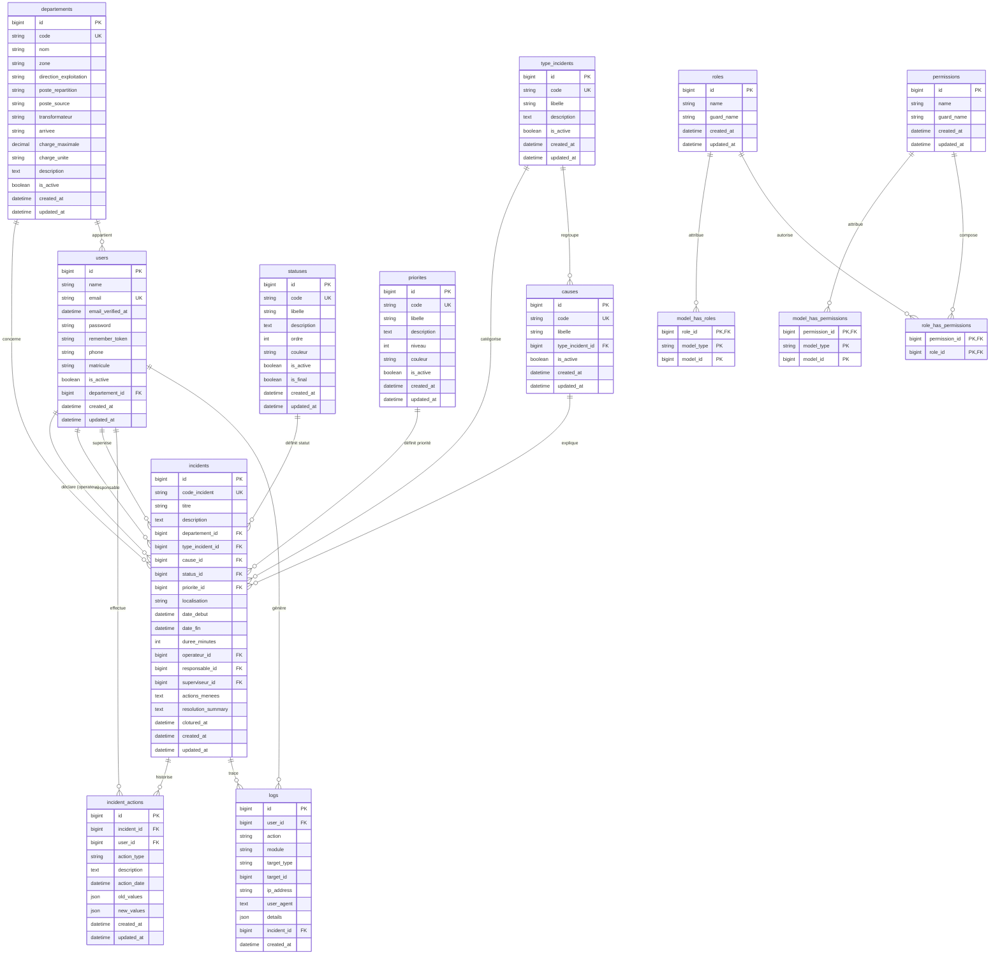

# Schéma de la base de données

## 1. Introduction
L'application de gestion des incidents du réseau électrique de la CEET s'appuie sur une base de données relationnelle **MySQL 8.4**.  
L'encodage recommandé est **utf8mb4** avec une collation de type **utf8mb4_unicode_ci** afin de garantir la prise en charge correcte des accents, symboles techniques et libellés métier en français.

La base est structurée autour de trois grands ensembles :

- les **données opérationnelles** : incidents, actions sur incident, logs ;
- les **catalogues de référence** : départements, types d'incidents, causes, statuts, priorités ;
- les **données d'administration** : utilisateurs, rôles et permissions Spatie.

L'objectif du schéma est de garantir :

- la **traçabilité** complète des incidents ;
- la **normalisation** des données métier ;
- la **sécurité d'accès** via un modèle rôles/permissions ;
- la **performance des tableaux de bord** et exports.

## 2. Diagramme ERD (Mermaid)

## 3. Description détaillée table par table

### 3.1 Table `users`
Rôle : stocke les comptes applicatifs et les informations d'identification des utilisateurs CEET.

| Champ | Type | Contrainte | Description |
| --- | --- | --- | --- |
| `id` | bigint | PK | Identifiant unique de l'utilisateur |
| `name` | string | requis | Nom complet affiché dans l'interface |
| `email` | string | unique, requis | Adresse e-mail de connexion |
| `email_verified_at` | datetime | nullable | Date de vérification de l'adresse e-mail |
| `password` | string | requis | Mot de passe haché |
| `remember_token` | string | nullable | Jeton de reconnexion Laravel |
| `phone` | string | nullable | Numéro de téléphone professionnel |
| `matricule` | string | nullable | Référence RH ou matricule interne |
| `is_active` | boolean | défaut applicatif | Active ou désactive le compte |
| `departement_id` | bigint | FK nullable vers `departements.id` | Départ ou entité de rattachement de l'utilisateur |
| `created_at` | datetime | auto | Date de création du compte |
| `updated_at` | datetime | auto | Date de dernière modification |

### 3.2 Table `departements`
Rôle : catalogue des départs, postes ou entités réseau CEET.

| Champ | Type | Contrainte | Description |
| --- | --- | --- | --- |
| `id` | bigint | PK | Identifiant du départ |
| `code` | string | unique, requis | Code court interne du départ |
| `nom` | string | requis | Nom métier du départ |
| `zone` | string | nullable | Zone ou périmètre géographique |
| `direction_exploitation` | string | nullable | Direction ou secteur d'exploitation |
| `poste_repartition` | string | nullable | Poste de répartition associé |
| `poste_source` | string | nullable | Poste source d'alimentation |
| `transformateur` | string | nullable | Transformateur principal lié au départ |
| `arrivee` | string | nullable | Arrivée électrique de référence |
| `charge_maximale` | decimal | nullable | Charge maximale théorique ou admissible |
| `charge_unite` | string | défaut `A` | Unité de charge, généralement ampère |
| `description` | text | nullable | Commentaires techniques ou remarques |
| `is_active` | boolean | requis | Disponibilité du départ dans les catalogues |
| `created_at` | datetime | auto | Date de création |
| `updated_at` | datetime | auto | Date de modification |

### 3.3 Table `type_incidents`
Rôle : classification normalisée des incidents réseau.

| Champ | Type | Contrainte | Description |
| --- | --- | --- | --- |
| `id` | bigint | PK | Identifiant du type |
| `code` | string | unique, requis | Code métier du type d'incident |
| `libelle` | string | requis | Intitulé lisible du type |
| `description` | text | nullable | Description technique du type |
| `is_active` | boolean | requis | Permet d'activer ou masquer un type |
| `created_at` | datetime | auto | Date de création |
| `updated_at` | datetime | auto | Date de modification |

### 3.4 Table `causes`
Rôle : causes probables ou confirmées d'un incident.

| Champ | Type | Contrainte | Description |
| --- | --- | --- | --- |
| `id` | bigint | PK | Identifiant de la cause |
| `code` | string | unique, requis | Code court de la cause |
| `libelle` | string | requis | Libellé métier |
| `type_incident_id` | bigint | FK nullable vers `type_incidents.id` | Association facultative à un type d'incident |
| `is_active` | boolean | requis | Active ou désactive la cause dans les formulaires |
| `created_at` | datetime | auto | Date de création |
| `updated_at` | datetime | auto | Date de modification |

### 3.5 Table `statuses`
Rôle : états possibles du cycle de vie d'un incident.

| Champ | Type | Contrainte | Description |
| --- | --- | --- | --- |
| `id` | bigint | PK | Identifiant du statut |
| `code` | string | unique, requis | Code métier du statut |
| `libelle` | string | requis | Libellé affiché dans l'interface |
| `description` | text | nullable | Définition métier du statut |
| `ordre` | int | requis | Ordre logique d'affichage |
| `couleur` | string | nullable | Couleur d'affichage du badge ou du graphique |
| `is_active` | boolean | requis | Statut disponible ou non |
| `is_final` | boolean | requis | Indique si l'incident est considéré clôturable/résolu |
| `created_at` | datetime | auto | Date de création |
| `updated_at` | datetime | auto | Date de modification |

### 3.6 Table `priorites`
Rôle : niveaux d'urgence et d'escalade des incidents.

| Champ | Type | Contrainte | Description |
| --- | --- | --- | --- |
| `id` | bigint | PK | Identifiant de la priorité |
| `code` | string | unique, requis | Code de priorité |
| `libelle` | string | requis | Libellé métier |
| `description` | text | nullable | Signification opérationnelle |
| `niveau` | int | requis | Niveau numérique, `1` correspondant au plus critique |
| `couleur` | string | nullable | Couleur d'affichage |
| `is_active` | boolean | requis | Active ou désactive la priorité |
| `created_at` | datetime | auto | Date de création |
| `updated_at` | datetime | auto | Date de modification |

### 3.7 Table `incidents`
Rôle : table centrale de l'application, contenant toutes les déclarations d'incidents réseau.

| Champ | Type | Contrainte | Description |
| --- | --- | --- | --- |
| `id` | bigint | PK | Identifiant interne |
| `code_incident` | string | unique, requis | Code métier généré automatiquement, ex. `INC-20260330-ABCDE` |
| `titre` | string | requis | Titre court de l'incident |
| `description` | text | nullable | Description détaillée du constat |
| `departement_id` | bigint | FK vers `departements.id` | Départ concerné |
| `type_incident_id` | bigint | FK vers `type_incidents.id` | Catégorie d'incident |
| `cause_id` | bigint | FK nullable vers `causes.id` | Cause renseignée ou suspectée |
| `status_id` | bigint | FK vers `statuses.id` | Statut courant |
| `priorite_id` | bigint | FK vers `priorites.id` | Niveau de criticité |
| `localisation` | string | nullable | Localisation libre ou précision terrain |
| `date_debut` | datetime | requis | Date et heure de début de l'incident |
| `date_fin` | datetime | nullable | Date et heure de fin réelle |
| `duree_minutes` | int | nullable | Durée calculée automatiquement en minutes |
| `operateur_id` | bigint | FK vers `users.id` | Utilisateur déclarant l'incident |
| `responsable_id` | bigint | FK nullable vers `users.id` | Responsable terrain ou chef d'équipe |
| `superviseur_id` | bigint | FK nullable vers `users.id` | Superviseur validant le traitement |
| `actions_menees` | text | nullable | Actions techniques réalisées |
| `resolution_summary` | text | nullable | Résumé de résolution ou de clôture |
| `clotured_at` | datetime | nullable | Horodatage de clôture logique |
| `created_at` | datetime | auto | Date de création |
| `updated_at` | datetime | auto | Date de dernière mise à jour |

### 3.8 Table `incident_actions`
Rôle : journal détaillé des actions métier sur chaque incident.

| Champ | Type | Contrainte | Description |
| --- | --- | --- | --- |
| `id` | bigint | PK | Identifiant de l'action |
| `incident_id` | bigint | FK vers `incidents.id` | Incident concerné |
| `user_id` | bigint | FK vers `users.id` | Utilisateur ayant effectué l'action |
| `action_type` | string | requis | Type d'action : `create`, `update`, `delete`, `cloture` |
| `description` | text | requis | Description métier de l'opération |
| `action_date` | datetime | requis | Date réelle de l'action |
| `old_values` | json | nullable | Anciennes valeurs avant modification |
| `new_values` | json | nullable | Nouvelles valeurs après modification |
| `created_at` | datetime | auto | Date de création de la ligne |
| `updated_at` | datetime | auto | Date de modification de la ligne |

### 3.9 Table `logs`
Rôle : piste d'audit transverse pour l'ensemble de l'application.

| Champ | Type | Contrainte | Description |
| --- | --- | --- | --- |
| `id` | bigint | PK | Identifiant du log |
| `user_id` | bigint | FK nullable vers `users.id` | Auteur de l'action, si connu |
| `action` | string | requis | Verbe d'action : création, mise à jour, suppression, etc. |
| `module` | string | requis | Module concerné, ex. `incidents` |
| `target_type` | string | nullable | Classe ou type de ressource ciblée |
| `target_id` | bigint | nullable | Identifiant de la ressource ciblée |
| `ip_address` | string | nullable | Adresse IP du client |
| `user_agent` | text | nullable | Agent utilisateur / navigateur |
| `details` | json | nullable | Détails additionnels de l'opération |
| `incident_id` | bigint | FK nullable vers `incidents.id` | Référence incidente si le log y est lié |
| `created_at` | datetime | auto | Date de création |

### 3.10 Table `roles`
Rôle : rôles applicatifs gérés par le package Spatie.

| Champ | Type | Contrainte | Description |
| --- | --- | --- | --- |
| `id` | bigint | PK | Identifiant du rôle |
| `name` | string | requis | Nom du rôle, ex. `Administrateur` |
| `guard_name` | string | requis | Garde d'authentification, généralement `web` |
| `created_at` | datetime | auto | Date de création |
| `updated_at` | datetime | auto | Date de modification |

### 3.11 Table `permissions`
Rôle : permissions atomiques affectées aux rôles ou directement aux utilisateurs.

| Champ | Type | Contrainte | Description |
| --- | --- | --- | --- |
| `id` | bigint | PK | Identifiant de la permission |
| `name` | string | requis | Nom de la permission, ex. `incidents.view` |
| `guard_name` | string | requis | Garde d'authentification |
| `created_at` | datetime | auto | Date de création |
| `updated_at` | datetime | auto | Date de modification |

### 3.12 Table `model_has_roles`
Rôle : table pivot entre un modèle Eloquent et un rôle Spatie.

| Champ | Type | Contrainte | Description |
| --- | --- | --- | --- |
| `role_id` | bigint | PK, FK vers `roles.id` | Rôle attribué |
| `model_type` | string | PK | Classe du modèle ciblé, ici principalement `App\Models\User` |
| `model_id` | bigint | PK | Identifiant du modèle ciblé |

### 3.13 Table `model_has_permissions`
Rôle : table pivot d'attribution directe de permissions à un modèle.

| Champ | Type | Contrainte | Description |
| --- | --- | --- | --- |
| `permission_id` | bigint | PK, FK vers `permissions.id` | Permission attribuée |
| `model_type` | string | PK | Classe du modèle ciblé |
| `model_id` | bigint | PK | Identifiant du modèle ciblé |

### 3.14 Table `role_has_permissions`
Rôle : table pivot associant les permissions aux rôles.

| Champ | Type | Contrainte | Description |
| --- | --- | --- | --- |
| `permission_id` | bigint | PK, FK vers `permissions.id` | Permission concernée |
| `role_id` | bigint | PK, FK vers `roles.id` | Rôle bénéficiaire |

## 4. Index et performances

### 4.1 Index existants issus des migrations

| Table | Index | Nature | Justification métier |
| --- | --- | --- | --- |
| `users` | `PRIMARY(id)` | primaire | Accès rapide aux utilisateurs |
| `users` | `users_email_unique` | unique | Connexion par e-mail et intégrité métier |
| `users` | index FK `departement_id` | index simple | Filtrage des utilisateurs par rattachement |
| `departements` | `PRIMARY(id)` | primaire | Accès rapide aux départs |
| `departements` | `departements_code_unique` | unique | Unicité du code départ |
| `type_incidents` | `type_incidents_code_unique` | unique | Évite les doublons de types |
| `causes` | `causes_code_unique` | unique | Évite les doublons de causes |
| `causes` | index FK `type_incident_id` | index simple | Chargement dynamique des causes par type |
| `statuses` | `statuses_code_unique` | unique | Référence stable des statuts |
| `priorites` | `priorites_code_unique` | unique | Référence stable des priorités |
| `incidents` | `incidents_code_incident_unique` | unique | Recherche et traçabilité métier |
| `incidents` | index FK `departement_id` | index simple | Rapports et filtrage par départ |
| `incidents` | index FK `type_incident_id` | index simple | Statistiques par type |
| `incidents` | index FK `cause_id` | index simple | Analyse causale |
| `incidents` | index FK `status_id` | index simple | Vue des incidents en cours / clôturés |
| `incidents` | index FK `priorite_id` | index simple | Tri par criticité |
| `incidents` | index FK `operateur_id` | index simple | Liste des incidents déclarés |
| `incidents` | index FK `responsable_id` | index simple | Affectation terrain |
| `incidents` | index FK `superviseur_id` | index simple | Suivi supervision |
| `incident_actions` | index FK `incident_id` | index simple | Chargement de l'historique par incident |
| `incident_actions` | index FK `user_id` | index simple | Audit des actions par utilisateur |
| `logs` | index FK `user_id` | index simple | Recherche d'audit par auteur |
| `logs` | index FK `incident_id` | index simple | Audit ciblé sur un incident |
| `roles` | `roles_name_guard_name_unique` | unique composite | Unicité du nom de rôle par garde |
| `permissions` | `permissions_name_guard_name_unique` | unique composite | Unicité des permissions |
| `model_has_roles` | PK composite | primaire composite | Liaison rapide rôle-modèle |
| `model_has_permissions` | PK composite | primaire composite | Liaison rapide permission-modèle |
| `role_has_permissions` | PK composite | primaire composite | Vérification rapide des droits d'un rôle |

### 4.2 Index recommandés pour l'évolution

| Table | Index recommandé | Type | Intérêt |
| --- | --- | --- | --- |
| `incidents` | `(departement_id, status_id)` | composite | Optimise les dashboards et la vue des incidents ouverts par départ |
| `incidents` | `(priorite_id, date_debut)` | composite | Optimise le tri opérationnel des incidents critiques les plus anciens |
| `incidents` | `(date_debut, date_fin)` | composite | Accélère les rapports journaliers et mensuels |
| `incidents` | `(type_incident_id, cause_id)` | composite | Optimise les analyses croisées type/cause |
| `incident_actions` | `(incident_id, action_date)` | composite | Accélère l'affichage chronologique de l'historique |
| `logs` | `(module, created_at)` | composite | Optimise les recherches d'audit par module et période |
| `logs` | `(target_type, target_id)` | composite | Optimise le lien vers la ressource auditée |
| `users` | `(is_active, departement_id)` | composite | Optimise l'affectation des opérateurs actifs par départ |

## 5. Données de référence préchargées

### 5.1 Statuts
| Code | Libellé | Ordre | Couleur | `is_final` | Usage |
| --- | --- | --- | --- | --- | --- |
| `EN_COURS` | En cours | 1 | `#ffc107` | `false` | Incident déclaré, en attente de prise en charge |
| `EN_TRAITEMENT` | En traitement | 2 | `#17a2b8` | `false` | Intervention terrain ou investigation en cours |
| `RESOLU` | Résolu | 3 | `#28a745` | `true` | Incident techniquement résolu |
| `CLOTURE` | Clôturé | 4 | `#6c757d` | `true` | Incident clôturé administrativement |

### 5.2 Priorités
| Code | Libellé | Niveau | Couleur | Interprétation |
| --- | --- | --- | --- | --- |
| `CRITICAL` | Critique | 1 | `#dc3545` | Incident majeur, action immédiate |
| `HIGH` | Haute | 2 | `#fd7e14` | Incident important, traitement prioritaire |
| `MEDIUM` | Moyenne | 3 | `#ffc107` | Priorité standard |
| `LOW` | Faible | 4 | `#28a745` | Faible impact, traitement planifiable |

### 5.3 Exemples de types d'incidents
| Code | Libellé | Description |
| --- | --- | --- |
| `DISJ_FR` | Disjonction Franche | Coupure franche nécessitant recherche de défaut |
| `DARR` | DARR | Déclenchement automatique régulé réseau |
| `DARL` | DARL | Déclenchement automatique régulé ligne |
| `MT` | Manque de tension | Absence ou insuffisance de tension sur un départ |
| `BLACKOUT` | Black Out | Interruption totale d'alimentation |

### 5.4 Exemples de causes
| Code | Libellé | Type associé |
| --- | --- | --- |
| `CABLE_PIOCHE` | Câble pioché | `DISJ_FR` |
| `VANDALISME` | Vandalisme | `VAND` |
| `CHUTE_ARBRE` | Chute d'arbre sur réseau | `MT` |
| `RUPTURE_CONDUCTEUR` | Rupture de conducteur | `DISJ_FR` |
| `SURCH_DEP` | Surcharge départ | `SURCH` |

## 6. Conclusion
Le schéma de base de données de l'application CEET est conçu pour concilier :

- la **stabilité métier** via des catalogues normalisés ;
- la **traçabilité forte** via `incident_actions` et `logs` ;
- la **souplesse d'administration** via Spatie Permission ;
- la **préparation à l'analyse** via des relations explicites et des index orientés reporting.

Ce document constitue la référence de modélisation pour les développements futurs, les audits techniques et les travaux de maintenance corrective ou évolutive.
